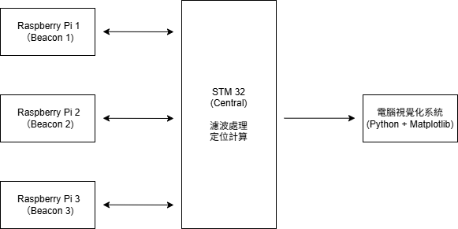

# BLE室內定位系統設計與實作報告

## 組員

李松桓 B11902098 張迪善 B11902116 謝明倫 B11901034

## 摘要

本專案實作了一個基於藍牙低功耗（Bluetooth Low Energy, BLE）技術的室內定位系統，透過接收信號強度指示（RSSI）進行距離測量，並結合三邊測量法（Trilateration）計算目標設備的空間座標。系統採用STM32L475VGT6作為Central，三台Raspberry Pi作為Beacon，實現即時定位與視覺化顯示。

## 1. 緒論與動機

### 1.1 研究背景

隨著物聯網（IoT）技術的快速發展，室內定位技術已成為智慧建築、資產追蹤、導航服務等應用的重要基礎。相較於GPS在室外的優異表現，室內環境因信號遮蔽而需要替代定位方案。

### 1.2 研究動機

本專案的主要動機包括：

- 深入了解BLE通訊機制與其在定位應用中的潛力
- 探討RSSI測距的可行性與精度限制
- 實際體驗室內定位系統的完整開發流程
- 處理真實環境中的雜訊與資料傳輸問題
- 建立即時、直觀的定位視覺化系統

### 1.3 研究目標

1. 實作基於BLE RSSI的距離測量演算法
2. 整合三邊測量法進行位置計算
3. 開發即時視覺化定位系統
4. 評估系統在理想環境下的定位精度

## 2. 系統架構與設計

### 2.1 硬體配置

- **中央設備**：STM32L475VGT6（BLE Central role）
- **Beacon設備**：3台Raspberry Pi（BLE Peripheral role）
- **顯示設備**：電腦（執行視覺化程式）
- **通訊介面**：BLE無線通訊、Serial port資料輸出

### 2.2 系統架構圖



### 2.3 定位原理

系統採用三邊測量法（Trilateration）進行定位：

1. STM32持續掃描並接收三個RPi錨點的BLE廣播封包
2. 提取RSSI值並透過卡爾曼濾波器處理雜訊
3. 將RSSI轉換為距離估計值
4. 利用三個距離值計算STM32的二維座標
5. 透過序列埠將結果傳送至電腦進行視覺化

## 3. 演算法實作

### 3.1 RSSI到距離轉換模型

採用經驗公式進行RSSI-距離轉換：

- 當ratio < 1.0時：`distance = ratio^10`
- 當ratio ≥ 1.0時：`distance = 0.89976 × ratio^7.7095 + 0.111`

其中ratio = 測量RSSI / 校準TxPower值

### 3.2 卡爾曼濾波器

為減少RSSI測量雜訊，實作卡爾曼濾波器：

- Process noise covariance：q = 0.47
- Measurement noise covariance：r = 3.8
- 即時更新濾波狀態以獲得平滑的RSSI值

### 3.3 三邊測量演算法

基於最小二乘法（Least Squares）實作三邊測量：

```
Beacon配置：
- Beacon A (0, 0)
- Beacon B (4.5, 0)  
- Beacon C (2.25, 3.897)
```

系統預先計算相關矩陣以提升運算效率：

- H矩陣：基於錨點幾何配置
- HTWH矩陣：H^T × W × H
- HTWH_INV：HTWH的反矩陣

### 3.4  Least Weighted Squares（LWS）

為改善三邊測量可能產生的解析誤差，實作Four-directional Local Search演算法：

- 以初始解為起點，向四個方向探索
- 採用梯度下降概念，尋找誤差平方和最小值
- 設定不同方向的收斂閾值以提升搜尋效率

## 4. 軟體實作

### 4.1 STM32韌體架構

採用FreeRTOS多執行緒架構：

- **TaskBLE thread**：負責BLE設備掃描與RSSI資料收集
- **TaskCompute thread**：執行濾波、距離轉換、定位計算
- **Semaphore mechanism**：協調threads間的資料同步

### 4.2 Raspberry Pi配置

每台RPi執行Python程式作為BLE Peripheral：

- 使用BlueZ堆疊進行藍牙操作
- 透過D-Bus註冊廣播服務
- 利用GLib/GObject維持非同步事件處理

### 4.3 視覺化系統

基於Python開發即時視覺化介面：

- **Serial port communication**：接收STM32傳送的JSON格式定位資料
- **Matplotlib動畫**：即時顯示定位點與錨點配置
- **距離圓圈顯示**：視覺化各錨點到目標的估計距離

## 5. 實驗結果與分析

### 5.1 測試環境

- 相對理想的室內環境
- 無其他藍牙設備干擾
- 最小化障礙物遮擋
- 固定錨點幾何配置

### 5.2 系統輸出

系統提供四種定位結果：

1. **未濾波原始解**：直接使用原始RSSI計算
2. **未濾波LWS優化解**：原始RSSI + 局部搜尋優化
3. **卡爾曼濾波解**：濾波後RSSI計算
4. **濾波LWS優化解**：濾波RSSI + 局部搜尋優化

### 5.3 精度評估

在理想測試環境下，系統能夠提供相對穩定的定位結果。然而，由於RSSI固有的變異性以及環境因素影響，定位精度仍存在限制。

## 6. 與現有技術比較

### 6.1 商業定位技術精度比較

- **Apple iBeacon**：常規1-3 m，優化後30 cm-1 m
- **UWB技術**：精度可達10 cm以內
- **BLE 5.1 Direction Finding**：0.1-1m精度範圍
- **本系統（BLE 4.2）**：在理想環境下可達50 cm的精度

## 7. 結論與未來展望

### 7.1 專案成果

本專案成功實作了完整的BLE室內定位系統，包含韌體開發、演算法實現、即時視覺化等核心功能。透過實際開發過程，深入理解了BLE通訊協定、RSSI特性、以及室內定位演算法的實作細節。

### 7.2 技術貢獻

1. 整合Kalman Filter與局部搜尋最佳化的定位演算法
2. 基於FreeRTOS的即時多執行緒BLE系統架構
3. 完整的端到端定位系統實作經驗

### 7.3 未來改進方向

1. **演算法優化**：
   - 探索機器學習方法改善RSSI-距離轉換的精度

2. **系統擴展**：
   - 支援更多beacon以提升定位精度與覆蓋範圍
   - 整合IMU感測器進行fusion positioning
   - 追蹤移動中的設備

3. **環境適應性**：
   - 自動環境校準機制
   - 動態參數調整演算法
   - 多環境定位模型切換

## 8. Demo影片
https://drive.google.com/file/d/1i-ObSf7Gs4Yoms-IY_MxhJVOKQd-MN7r/view

## 參考資料

1. https://www.st.com/resource/en/datasheet/bluenrg-ms.pdf

2. https://www.rxelectronics.cz/datasheet/62/BLUENRG-MSCSP.pdf

3. https://github.com/Douglas6/cputemp/tree/master

4. https://stackoverflow.com/questions/20416218/understanding-ibeacon-distancing

5. https://github.com/AltBeacon/android-beacon-library

6. https://en.wikipedia.org/wiki/IBeacon

7. https://www.fengmap.com/news/application/429.html

8. https://www.idmart.com.tw/UWB.php

9. https://www.bluetooth.com/learn-about-bluetooth/feature-enhancements/direction-finding/

## 附錄

### 附錄A：核心程式碼架構

詳細程式碼實作請參考專案原始碼，包含：

- STM32 BLE掃描與定位運算模組
- Raspberry Pi BLE廣播服務
- Python即時視覺化系統
